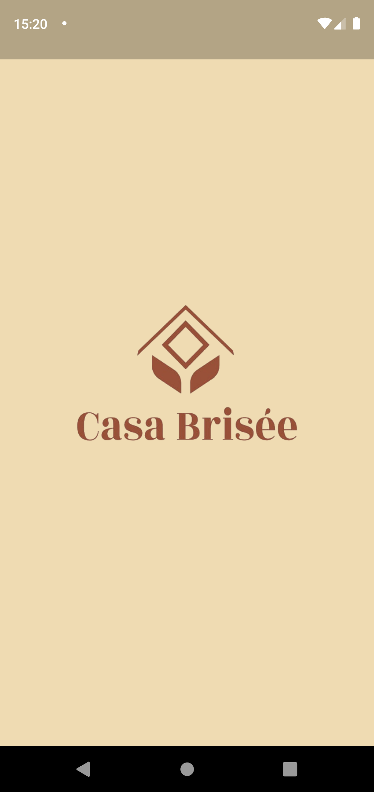
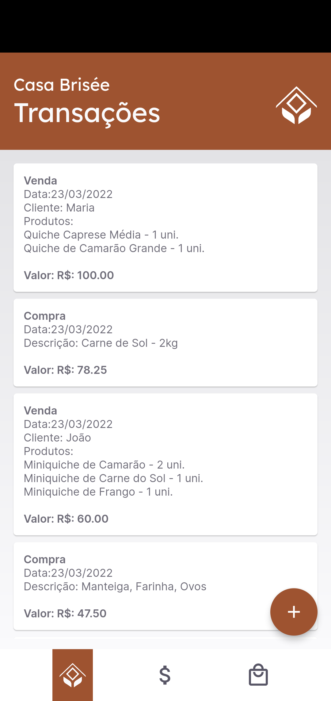
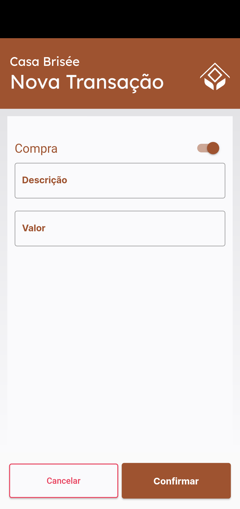
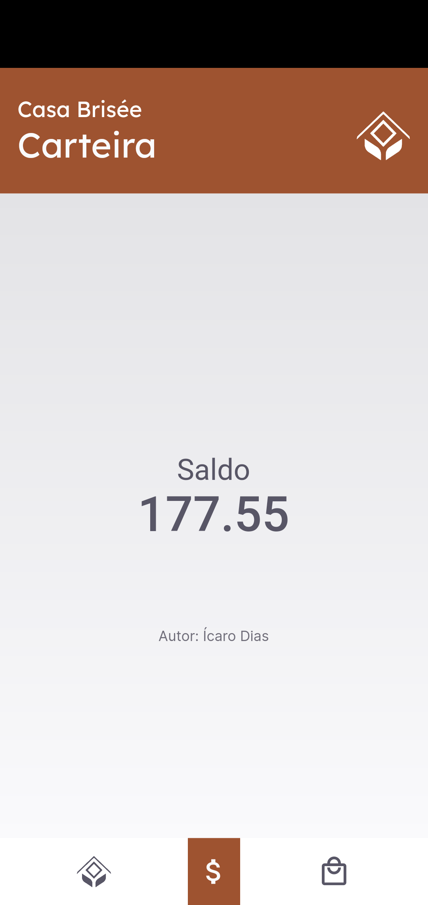
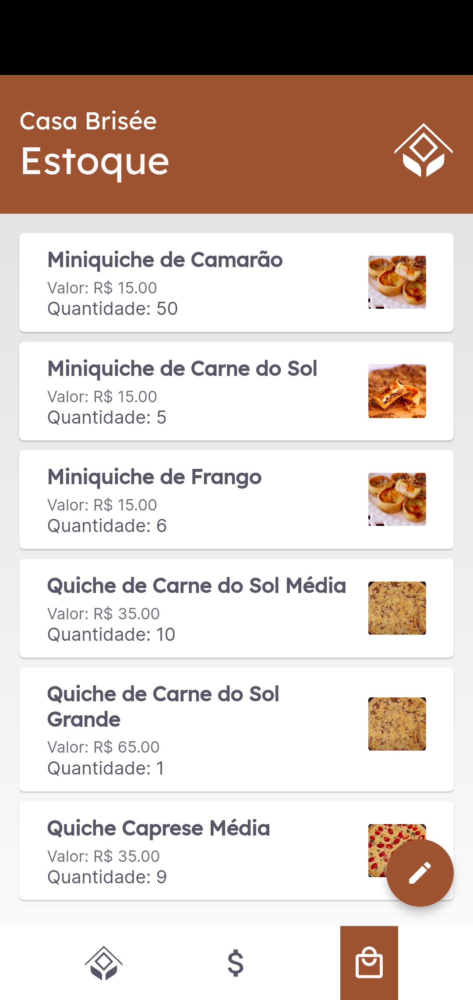
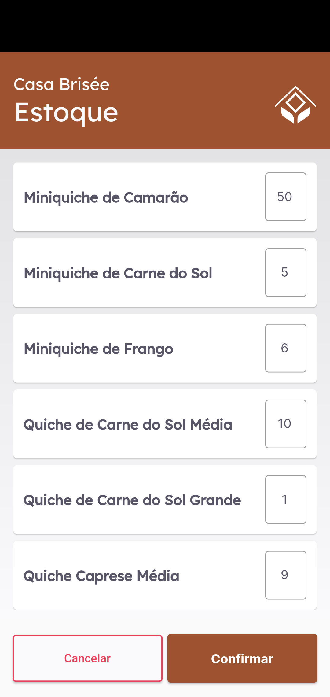

## Casa Brisée

O objetivo deste aplicativo é fazer o controle de estoque e financeiro da Casa Brisée. Casa Brisée é uma empresa do ramo alimentício que vende alguns produtos @casabrisee.

Este aplicativo tem duas ações principais:
* Registrar transações: Compras e Vendas
* Atualizar o Estoque.

Estas ações atualizam o saldo da carteira e a quantidade de cada produagens do app.

### Telas

|  Splash | Transação|  Nova Venda 
| :---: | :---: | :---: |

|  Nova Venda - Preenchida |  Nova Compra |  Nova Compra - Preenchida 
| :---: | :---: | :---: |

|  Carteira |  Estoque |  Editar Estoque
| :---: | :---: |:---: |

### Tecnologias

Esta aplicação foi toda desenvolvida em Flutter. Eu utilizei algumas bibliotecas para facilitar o desenvolvimento desta aplicação:

* Persistência de dados: sqflite (https://pub.dev/packages/sqflite)
* Fontes: google_fonts (https://pub.dev/packages/google_fonts)

Além disso, busquei informações em diversos locais para criar os widgets:
* Linguagem dart: curso da Udemy "Lógica de Programação com Dart" - instrutor Jacob Moura
* canal do youtube Prof. Diego Antunes (https://www.youtube.com/user/drantuness)
* Persistência de dados com Flutter (Alura)
----
Perspectivas futuras desta aplicação, adição de novas funcionalidades:
* Refatoração do código.
* Alteração de preços em estoque.
* Adição e remoção de produtos.
* Encomendas - vendas - serem convertidas em saldo no dia da encomenda.
____

Espero que esta aplicação seja útil para você e caso exista alguma dúvida ou sugestão, entre em contato comigo - icarodiasdev@gmail.com.